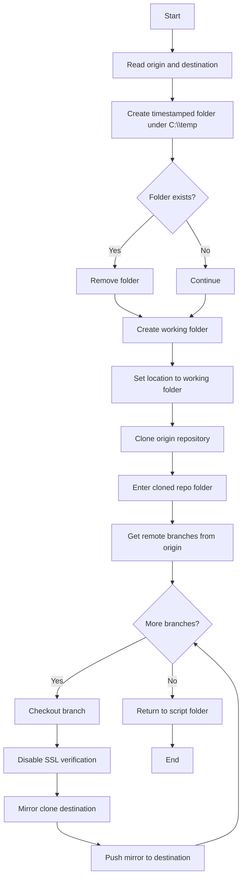

# PowerShell - Migrate Azure DevOps Repository

This script is meant to help migrate a Git repository from an origin URL to a destination URL while iterating through branches in the source repository.

## What the script does

1. Accepts two mandatory parameters:
   - `origin`: the source repository URL
   - `destination`: the target repository URL
2. Creates a timestamped working folder under `C:\temp`.
3. Clones the origin repository into that folder.
4. Reads the remote branches from `origin`.
5. For each branch, checks out the branch locally.
6. Disables SSL verification for Git at the global level.
7. Creates a mirror clone of the destination repository.
8. Pushes the mirrored repository to the destination.
9. Returns the shell to the script folder when finished.

## Prerequisites

- PowerShell
- Git installed and available on the PATH
- Access to both the origin and destination repositories
- Permission to write to `C:\temp`

## Parameters

### `origin`
The source repository URL that will be cloned first.

### `destination`
The repository URL that will receive the mirrored content.

## Step-by-step flow

### 1. Read the input values
The script starts by reading the two required parameters: `origin` and `destination`.

### 2. Build a unique working folder
It generates a timestamp and appends it to `C:\temp` so every run gets its own isolated folder.

### 3. Clean up any existing folder with the same name
If the timestamped folder already exists, the script removes it before continuing.

### 4. Create the working folder
The script creates the new directory and switches the current location to it.

### 5. Clone the origin repository
Git is called with SSL verification disabled for the clone operation:

```powershell
git -c http.sslVerify=false clone $origin
```

### 6. Enter the cloned repository
After cloning, the script finds the newly created repository folder and changes into it.

### 7. Collect the remote branch names
The script runs a Git command to list remote branches under `origin` and strips the `origin/` prefix.

### 8. Process each branch
For every branch, the script:
- writes the branch name to the console
- checks out the branch locally
- disables Git SSL verification globally
- clones the destination repository as a mirror
- pushes the mirrored repository to the destination

### 9. Return to the script folder
At the end, the script changes back to the folder that contains the PowerShell script.

## Usage example

```powershell
.\CloneDevOps_v2.ps1 -origin "https://source-server/example/source-repo.git" -destination "https://target-server/example/target-repo.git"
```

## Flow design



